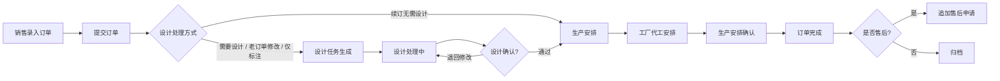
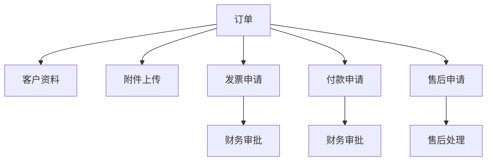

# 业务流程与角色边界

## 主流程

## 设计处理方式

设计处理方式是可自定义的基础资料，由管理员维护。订单提交时必须选择一种方式，系统根据该方式决定是否生成设计任务。

| 示例选项 | 是否生成设计任务 | 说明 |
| --- | --- | --- |
| 新订单需要设计 | 是 | 新定制订单，需要完整设计稿 |
| 老订单修改 | 是 | 基于历史订单修改尺寸、文字、图案等 |
| 仅标注 | 是 | 不需要完整设计稿，但需要设计人员做标注或生产说明 |
| 续订无需设计 | 否 | 复购或续订，直接进入生产安排 |

## 辅助流程

## 订单状态流转

| 状态 | 说明 | 可操作角色 |
| --- | --- | --- |
| 草稿 | 销售正在录入，尚未提交 | 销售、管理员 |
| 已提交 | 订单已确认，等待系统按设计处理方式分流 | 销售、设计、生产、管理员 |
| 待设计 | 当前设计处理方式需要设计任务 | 设计、管理员 |
| 设计中 | 设计人员处理设计稿、修改或标注 | 设计、管理员 |
| 设计确认 | 设计侧已确认，可进入生产安排 | 设计、生产、管理员 |
| 待生产安排 | 已进入工厂代工安排，等待确认 | 生产、管理员 |
| 已完成 | 生产安排已确认，订单闭环 | 销售、生产、管理员 |
| 已取消 | 订单取消，不再流转 | 销售、管理员 |

## 审批状态

| 状态 | 说明 |
| --- | --- |
| 草稿 | 申请人暂存，未提交 |
| 待审批 | 已提交，等待财务或管理员处理 |
| 已通过 | 审批通过，可进入后续业务 |
| 已驳回 | 审批不通过，需要修改或终止 |
| 已撤回 | 申请人主动撤回 |

## 角色边界

| 角色 | 主要职责 | 不应负责 |
| --- | --- | --- |
| 销售 | 录入订单、维护客户、提交售后、查看订单进度 | 修改设计结论、生产安排、财务审批 |
| 设计 | 查看设计任务、上传设计稿、更新设计状态 | 修改订单金额、审批付款 |
| 生产 | 查看待安排订单、确认工厂代工安排、记录异常 | 修改客户资料、审批发票 |
| 财务 | 审批发票、处理付款申请、查看金额信息 | 修改设计稿、生产安排 |
| 管理员 | 用户权限、基础资料、全局查看与异常处理 | 日常业务应尽量由对应角色处理 |

## v1 规则

- 订单提交时必须选择设计处理方式。
- 只有设计处理方式配置为“需要设计”时，才生成设计任务。
- 设计确认后，订单进入生产安排；无需设计的订单提交后直接进入生产安排。
- 生产安排确认后，订单即可标记为已完成。
- 售后申请必须关联订单，通常追加在已完成订单后。
- 发票申请和付款申请可以关联订单，也可以按客户维度查询。
- 所有关键状态变更必须记录操作人、时间和备注。
