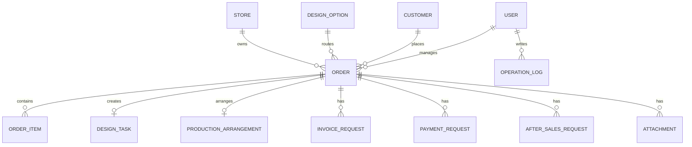

# PostgreSQL 数据库设计

## 设计原则

- 使用 PostgreSQL 作为正式数据库。
- 所有主键使用 UUID，避免未来跨系统导入或同步时冲突。
- 所有业务表包含 `created_at`、`updated_at`、`created_by_id`。
- 列表高频筛选字段必须建立索引。
- 附件不直接存数据库，数据库只保存文件元数据和访问地址。
- 订单状态变化、审批变化和关键字段变化必须写入操作日志。

## 核心关系

## 主要表

### stores

- `id uuid primary key`
- `name varchar(120) not null`
- `platform varchar(40) not null`
- `owner_id uuid null`
- `status varchar(20) not null default 'enabled'`

索引：

- `idx_stores_platform`
- `idx_stores_status`

### design_options

- `id uuid primary key`
- `name varchar(120) not null`
- `requires_design boolean not null default true`
- `sort_order integer not null default 0`
- `status varchar(20) not null default 'enabled'`
- `description text null`

索引：

- `idx_design_options_status_sort`

### customers

- `id uuid primary key`
- `name varchar(120) not null`
- `phone varchar(40) null`
- `wechat varchar(80) null`
- `address text null`
- `invoice_title varchar(200) null`
- `tax_number varchar(80) null`
- `remark text null`

索引：

- `idx_customers_name`
- `idx_customers_phone`

### orders

- `id uuid primary key`
- `order_no varchar(40) unique not null`
- `platform_order_no varchar(80) null`
- `store_id uuid not null`
- `customer_id uuid not null`
- `salesperson_id uuid not null`
- `design_option_id uuid not null`
- `status varchar(30) not null`
- `total_amount numeric(12,2) not null default 0`
- `paid_amount numeric(12,2) not null default 0`
- `payment_status varchar(30) not null`
- `delivery_date date null`
- `urgent boolean not null default false`
- `customization_note text null`
- `remark text null`
- `submitted_at timestamptz null`
- `completed_at timestamptz null`

索引：

- `idx_orders_order_no`
- `idx_orders_platform_order_no`
- `idx_orders_store_status`
- `idx_orders_design_option`
- `idx_orders_customer`
- `idx_orders_salesperson`
- `idx_orders_delivery_date`
- `idx_orders_created_at`
- `idx_orders_status_created_at`

### order_items

- `id uuid primary key`
- `order_id uuid not null`
- `product_name varchar(200) not null`
- `sku varchar(120) null`
- `quantity integer not null`
- `unit_price numeric(12,2) not null`
- `line_amount numeric(12,2) not null`
- `custom_size varchar(120) null`
- `custom_color varchar(120) null`
- `custom_note text null`

索引：

- `idx_order_items_order`

### design_tasks

- `id uuid primary key`
- `task_no varchar(40) unique not null`
- `order_id uuid unique not null`
- `designer_id uuid null`
- `status varchar(30) not null`
- `due_at timestamptz null`
- `confirmed_at timestamptz null`
- `remark text null`

索引：

- `idx_design_tasks_status`
- `idx_design_tasks_designer_status`
- `idx_design_tasks_due_at`

### production_arrangements

- `id uuid primary key`
- `arrangement_no varchar(40) unique not null`
- `order_id uuid unique not null`
- `owner_id uuid null`
- `factory_name varchar(160) null`
- `status varchar(30) not null`
- `planned_finish_at timestamptz null`
- `confirmed_at timestamptz null`
- `remark text null`

索引：

- `idx_production_arrangements_status`
- `idx_production_arrangements_owner_status`
- `idx_production_arrangements_planned_finish_at`

说明：

- `production_arrangements` 表记录生产安排，不记录工厂内部生产执行细节。
- 生产安排确认后，系统将关联订单状态更新为已完成。

### invoice_requests

- `id uuid primary key`
- `request_no varchar(40) unique not null`
- `order_id uuid null`
- `customer_id uuid not null`
- `invoice_type varchar(30) not null`
- `amount numeric(12,2) not null`
- `title varchar(200) not null`
- `tax_number varchar(80) null`
- `status varchar(30) not null`
- `applicant_id uuid not null`
- `approver_id uuid null`

索引：

- `idx_invoice_requests_status`
- `idx_invoice_requests_customer`
- `idx_invoice_requests_order`
- `idx_invoice_requests_applicant`

### payment_requests

- `id uuid primary key`
- `request_no varchar(40) unique not null`
- `order_id uuid null`
- `customer_id uuid null`
- `payment_type varchar(30) not null`
- `payee varchar(200) not null`
- `amount numeric(12,2) not null`
- `reason text not null`
- `status varchar(30) not null`
- `applicant_id uuid not null`
- `approver_id uuid null`

索引：

- `idx_payment_requests_status`
- `idx_payment_requests_order`
- `idx_payment_requests_customer`
- `idx_payment_requests_applicant`

### after_sales_requests

- `id uuid primary key`
- `request_no varchar(40) unique not null`
- `order_id uuid not null`
- `type varchar(30) not null`
- `status varchar(30) not null`
- `description text not null`
- `solution text null`
- `refund_amount numeric(12,2) null`
- `owner_id uuid null`

索引：

- `idx_after_sales_order`
- `idx_after_sales_status`
- `idx_after_sales_owner_status`

### attachments

- `id uuid primary key`
- `file_name varchar(255) not null`
- `file_url text not null`
- `file_type varchar(80) not null`
- `file_size integer not null`
- `business_type varchar(40) not null`
- `business_id uuid not null`
- `uploader_id uuid not null`

索引：

- `idx_attachments_business`
- `idx_attachments_uploader`

### operation_logs

- `id uuid primary key`
- `actor_id uuid not null`
- `business_type varchar(40) not null`
- `business_id uuid not null`
- `action varchar(80) not null`
- `before_value jsonb null`
- `after_value jsonb null`
- `remark text null`

索引：

- `idx_operation_logs_business`
- `idx_operation_logs_actor`
- `idx_operation_logs_created_at`

## 性能要求

- 订单列表、客户列表、任务列表、审批列表必须分页。
- 默认分页大小为 20，最大分页大小为 100。
- 列表接口只查询列表所需字段，详情接口再返回完整信息。
- Django ORM 查询订单列表时必须使用 `select_related` 关联店铺、客户、销售。
- 设计任务和生产安排列表根据页面需要使用 `select_related("order")`。
- 复杂报表使用定时汇总表或缓存，不允许每次打开首页扫描全表。
